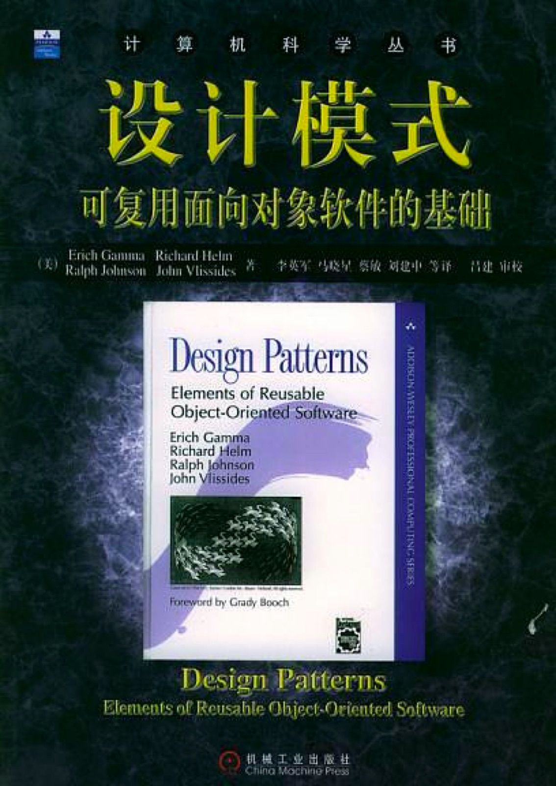
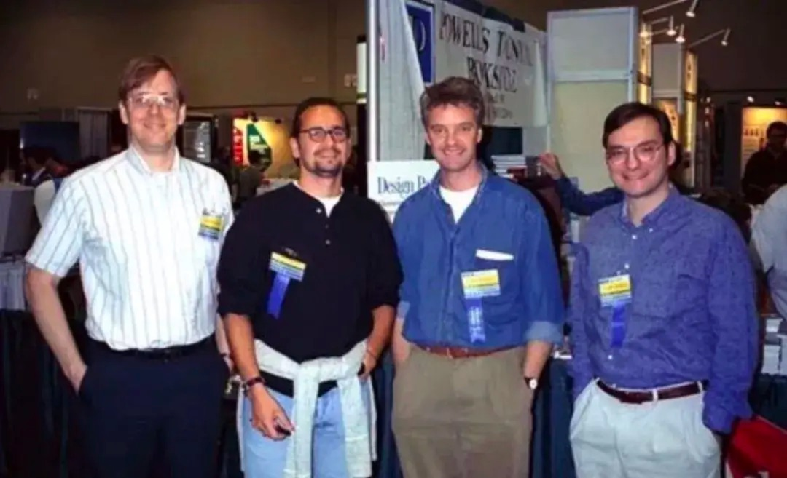

# 设计模式
## 由来

1977 年有位美国著名建筑大师提出，他叫[Christopher Alexander](https://zh.wikipedia.org/wiki/%E5%85%8B%E9%87%8C%E6%96%AF%E6%89%98%E4%BD%9B%C2%B7%E4%BA%9A%E5%8E%86%E5%B1%B1%E5%A4%A7)（克里斯托弗.亚历山大）拥有剑桥大学数学硕士学位和建筑学学士学位，以及哈佛大学建筑学博士学位。

1990 年，软件工程界开始研讨设计模式的话题。

1994 年，艾瑞克·伽马（Erich Gamma）、理査德·海尔姆（Richard Helm）、拉尔夫·约翰森（Ralph Johnson）、约翰·威利斯迪斯（John Vlissides）4 位作者合作出版了《设计模式：可复用面向对象软件的基础》，这几位作者常被称为『四人组』，Gang of Four （GoF）。

## 什么是设计模式
“每一个模式描述了一个在我们周围不断重复发生的问题，以及该问题的解决方案的核心。这样，你就能一次又一次地使用该方案而不必做重复劳动” ——Christopher Alexander。

## GoF设计模式
历史性著作《设计模式：可复用面向对象软件的基础》一书中描述了23种经典面向对象设计模式，创立了模式在软件设计中的地位，由于《设计模式》一书确定了设计模式的地位，通常所说的设计模式隐含地表示"面向对象设计模式"。但这并不意味"设计模式"就等于"面向对象设计模式"。

